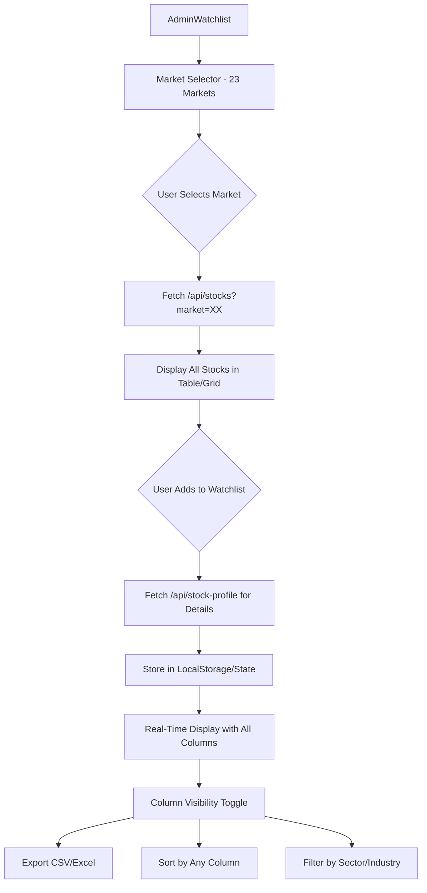

# Admin Watchlist - Ultra Premium Implementation Plan v2.0
## REAL DATA INTEGRATION - All Available API Fields

---

## 🔴 GOO MODE ACTIVATED - Zero Tolerance for Errors

---

## 📊 Phase 1: API Data Analysis Complete

### 1.1 Available API Endpoints

| Endpoint | Purpose | Response Structure |
|----------|---------|-------------------|
| `/api/stocks?market=XX` | All stocks for a market | Array of stock objects |
| `/api/stock-profile?symbol=XXX` | Detailed stock profile | Full 60+ field object |

### 1.2 Stock List API Fields (`/api/stocks`)

From live API call to `https://bhidy-app.pages.dev/api/stocks?market=US`:

```json
{
    "symbol": "AAPL",
    "name": "Apple",
    "category": "US",
    "country": "🇺🇸",
    "sector": "Technology",
    "logo": "https://t1.gstatic.com/...",
    "price": 273.67,
    "regularMarketPrice": 273.67,
    "change": 1.480011,
    "regularMarketChange": 1.480011,
    "changePercent": 0.5437419,
    "regularMarketChangePercent": 0.5437419,
    "prevClose": 272.19,
    "volume": 144632048,
    "marketCap": 4061369729024,
    "peRatio": 36.63588,
    "dividendYield": 0.0037473822,
    "lastUpdated": "2025-12-22T09:50:28.860Z"
}
```

### 1.3 Stock Profile API Fields (`/api/stock-profile`)

From live API call to `/api/stock-profile?symbol=AAPL`:

```json
{
    // IDENTITY (6 fields)
    "symbol": "AAPL",
    "name": "Apple Inc.",
    "description": "Apple Inc. designs...",
    "sector": "Technology",
    "industry": "Consumer Electronics",
    "employees": 166000,
    
    // COMPANY INFO (4 fields)
    "website": "https://www.apple.com",
    "city": "Cupertino",
    "country": "United States",
    "exchange": "NMS",
    
    // PRICE DATA (8 fields)
    "currency": "USD",
    "price": 273.67,
    "change": 1.480011,
    "changePercent": 0.5437419,
    "open": 272.145,
    "high": 274.5763,
    "low": 269.9,
    "prevClose": 272.19,
    
    // VOLUME & MARKET (3 fields)
    "volume": 144632048,
    "averageVolume": 51065060,
    "marketCap": 4061369729024,
    
    // 52-WEEK DATA (6 fields)
    "fiftyTwoWeekHigh": 288.62,
    "fiftyTwoWeekLow": 169.21,
    "fiftyDayAverage": 269.5178,
    "twoHundredDayAverage": 229.9118,
    "fiftyTwoWeekChange": 0.07208049,
    "beta": 1.107,
    
    // VALUATION (9 fields)
    "trailingPE": 36.63588,
    "forwardPE": 29.924532,
    "trailingEps": 7.47,
    "forwardEps": 9.14534,
    "priceToBook": 54.8327,
    "priceToSalesTrailing12Months": 9.7591305,
    "enterpriseValue": 4101524422656,
    "enterpriseToRevenue": 9.856,
    "enterpriseToEbitda": 28.336,
    
    // DIVIDEND (5 fields)
    "dividendYield": 0.0037473822,
    "trailingAnnualDividendYield": 0.0037473822,
    "trailingAnnualDividendRate": 1.02,
    "exDividendDate": "2025-11-10T00:00:00.000Z",
    "payoutRatio": 0.1367,
    
    // PROFITABILITY (11 fields)
    "totalRevenue": 416161005568,
    "revenuePerShare": 27.84,
    "revenueGrowth": 0.079,
    "grossProfits": 195201007616,
    "ebitda": 144748003328,
    "netIncomeToCommon": 112010002432,
    "profitMargins": 0.26915002,
    "grossMargins": 0.46905,
    "operatingMargins": 0.31647,
    "ebitdaMargins": 0.34782,
    "earningsGrowth": 0.912,
    
    // CASH & DEBT (6 fields)
    "operatingCashflow": 111482003456,
    "freeCashflow": 78862254080,
    "totalCash": 54697000960,
    "totalCashPerShare": 3.702,
    "totalDebt": 112377004032,
    "debtToEquity": 152.411,
    
    // FINANCIAL HEALTH (4 fields)
    "bookValue": 4.991,
    "currentRatio": 0.893,
    "quickRatio": 0.771,
    "returnOnEquity": 1.7142199,
    
    // SHARES (4 fields)
    "sharesOutstanding": 14776353000,
    "floatShares": 14750642146,
    "sharesShort": 129458559,
    "shortRatio": 2.64,
    
    // ANALYST ESTIMATES (7 fields)
    "targetMeanPrice": 287.70682,
    "targetHighPrice": 350,
    "targetLowPrice": 215,
    "targetMedianPrice": 300,
    "recommendationKey": "buy",
    "recommendationMean": 2,
    "numberOfAnalystOpinions": 41
}
```

**TOTAL: 73 data fields available per stock!**

---

## 📋 Phase 2: Watchlist Column Design

### 2.1 Column Groups for Watchlist Table

Based on the available data, here are the columns organized by category:

#### **DEFAULT VIEW COLUMNS** (Always Visible)
| Column | Field | Format | Width |
|--------|-------|--------|-------|
| Logo | `logo` | Image | 48px |
| Symbol | `symbol` | Text | 80px |
| Name | `name` | Text | 160px |
| Price | `price` | Currency | 100px |
| Change | `change` | +/- Number | 80px |
| Change % | `changePercent` | +/- % | 80px |
| Volume | `volume` | Compact Number | 100px |
| Market Cap | `marketCap` | Compact Number | 120px |
| Sector | `sector` | Badge | 120px |
| Actions | - | Buttons | 100px |

#### **OPTIONAL COLUMNS** (Toggle via Settings)

**Valuation Metrics**
| Column | Field | Format |
|--------|-------|--------|
| P/E Ratio | `trailingPE` | Decimal |
| Forward P/E | `forwardPE` | Decimal |
| EPS (TTM) | `trailingEps` | Currency |
| Forward EPS | `forwardEps` | Currency |
| P/B Ratio | `priceToBook` | Decimal |
| P/S Ratio | `priceToSalesTrailing12Months` | Decimal |
| EV/Revenue | `enterpriseToRevenue` | Decimal |
| EV/EBITDA | `enterpriseToEbitda` | Decimal |

**Performance Metrics**
| Column | Field | Format |
|--------|-------|--------|
| 52W High | `fiftyTwoWeekHigh` | Currency |
| 52W Low | `fiftyTwoWeekLow` | Currency |
| 50D Avg | `fiftyDayAverage` | Currency |
| 200D Avg | `twoHundredDayAverage` | Currency |
| 52W Change | `fiftyTwoWeekChange` | Percent |
| Beta | `beta` | Decimal |

**Dividend Metrics**
| Column | Field | Format |
|--------|-------|--------|
| Div Yield | `dividendYield` | Percent |
| Div Rate | `trailingAnnualDividendRate` | Currency |
| Payout Ratio | `payoutRatio` | Percent |
| Ex-Div Date | `exDividendDate` | Date |

**Profitability Metrics**
| Column | Field | Format |
|--------|-------|--------|
| Revenue | `totalRevenue` | Compact Number |
| Gross Margin | `grossMargins` | Percent |
| Profit Margin | `profitMargins` | Percent |
| ROE | `returnOnEquity` | Percent |
| Growth | `revenueGrowth` | Percent |

**Balance Sheet**
| Column | Field | Format |
|--------|-------|--------|
| Cash | `totalCash` | Compact Number |
| Debt | `totalDebt` | Compact Number |
| Debt/Equity | `debtToEquity` | Decimal |
| Current Ratio | `currentRatio` | Decimal |

**Analyst Data**
| Column | Field | Format |
|--------|-------|--------|
| Target Price | `targetMeanPrice` | Currency |
| Recommendation | `recommendationKey` | Badge |
| # Analysts | `numberOfAnalystOpinions` | Number |
| Upside | Calculated | Percent |

---

## 🏗️ Architecture - Real Data Flow



---

## 📁 Files to Create

### 1. `src/cms/AdminWatchlist.jsx` (~1000 lines)

**Key Features:**
- Market selector with all 23 markets + flags
- Real-time stock data from `/api/stocks`
- Detailed data from `/api/stock-profile`
- Column visibility toggles
- Multiple view modes (Table/Grid/Compact)
- Export to CSV functionality
- Sort by any column
- Filter by sector/industry

### 2. `src/cms/components/WatchlistTable.jsx` (~400 lines)

**Features:**
- Virtualized table for performance (react-window)
- Configurable columns
- Sortable headers
- Row actions (View Profile, Add Alert, Remove)
- Sticky header
- Responsive horizontal scroll

### 3. `src/cms/components/WatchlistGrid.jsx` (~200 lines)

**Features:**
- Grid view for visual preference
- Premium card design
- Key metrics at a glance
- Sparkline integration

### 4. `src/cms/components/ColumnSettings.jsx` (~150 lines)

**Features:**
- Column visibility toggles
- Column group presets (Valuation, Dividend, etc.)
- Save preferences to localStorage

---

## 🎨 Design Specifications

### Color Palette (Atlas Intel Branding)
```css
/* Primary */
--accent-emerald: #10B981;
--accent-amber: #F59E0B;

/* Status */
--bullish: #10B981;
--bearish: #EF4444;
--neutral: #6B7280;

/* Backgrounds */
--surface-dark: #0F172A;
--surface-light: #F1F5F9;
--glass: rgba(255, 255, 255, 0.95);

/* Table */
--row-hover: rgba(16, 185, 129, 0.05);
--row-selected: rgba(16, 185, 129, 0.1);
--border: #E2E8F0;
```

### Table Styling
```css
.watchlist-table {
    font-family: 'Inter', sans-serif;
    border-collapse: separate;
    border-spacing: 0;
    width: 100%;
}

.watchlist-table th {
    background: linear-gradient(180deg, #F8FAFC 0%, #F1F5F9 100%);
    font-size: 0.75rem;
    font-weight: 700;
    text-transform: uppercase;
    letter-spacing: 0.05em;
    color: #64748B;
    padding: 1rem;
    position: sticky;
    top: 0;
    z-index: 10;
    border-bottom: 2px solid #E2E8F0;
}

.watchlist-table td {
    padding: 0.875rem 1rem;
    border-bottom: 1px solid #F1F5F9;
    font-size: 0.875rem;
}

.watchlist-table tr:hover {
    background: rgba(16, 185, 129, 0.03);
}
```

---

## 🔧 Component Specifications

### AdminWatchlist.jsx State

```javascript
// Market Selection
const [selectedMarket, setSelectedMarket] = useState('US');
const [marketStocks, setMarketStocks] = useState([]);
const [isLoadingMarket, setIsLoadingMarket] = useState(false);

// Watchlist (persisted to localStorage)
const [watchlist, setWatchlist] = useState([]);
const [watchlistDetails, setWatchlistDetails] = useState({});

// View Options
const [viewMode, setViewMode] = useState('table'); // 'table' | 'grid' | 'compact'
const [visibleColumns, setVisibleColumns] = useState(DEFAULT_COLUMNS);
const [sortConfig, setSortConfig] = useState({ key: 'symbol', direction: 'asc' });
const [searchQuery, setSearchQuery] = useState('');
const [sectorFilter, setSectorFilter] = useState('all');

// UI State
const [showColumnSettings, setShowColumnSettings] = useState(false);
const [showAddStockModal, setShowAddStockModal] = useState(false);
const [selectedStock, setSelectedStock] = useState(null);
const [isExporting, setIsExporting] = useState(false);
```

### Column Configuration

```javascript
const ALL_COLUMNS = [
    // Default Columns
    { key: 'logo', label: '', width: 48, sortable: false, group: 'default' },
    { key: 'symbol', label: 'Symbol', width: 80, sortable: true, group: 'default' },
    { key: 'name', label: 'Name', width: 160, sortable: true, group: 'default' },
    { key: 'price', label: 'Price', width: 100, sortable: true, format: 'currency', group: 'default' },
    { key: 'change', label: 'Change', width: 80, sortable: true, format: 'change', group: 'default' },
    { key: 'changePercent', label: 'Change %', width: 80, sortable: true, format: 'percent', group: 'default' },
    { key: 'volume', label: 'Volume', width: 100, sortable: true, format: 'compact', group: 'default' },
    { key: 'marketCap', label: 'Mkt Cap', width: 120, sortable: true, format: 'compact', group: 'default' },
    { key: 'sector', label: 'Sector', width: 120, sortable: true, format: 'badge', group: 'default' },
    
    // Valuation
    { key: 'trailingPE', label: 'P/E', width: 80, sortable: true, format: 'decimal', group: 'valuation' },
    { key: 'forwardPE', label: 'Fwd P/E', width: 80, sortable: true, format: 'decimal', group: 'valuation' },
    { key: 'priceToBook', label: 'P/B', width: 80, sortable: true, format: 'decimal', group: 'valuation' },
    { key: 'enterpriseToEbitda', label: 'EV/EBITDA', width: 90, sortable: true, format: 'decimal', group: 'valuation' },
    
    // Performance
    { key: 'fiftyTwoWeekHigh', label: '52W High', width: 100, sortable: true, format: 'currency', group: 'performance' },
    { key: 'fiftyTwoWeekLow', label: '52W Low', width: 100, sortable: true, format: 'currency', group: 'performance' },
    { key: 'beta', label: 'Beta', width: 70, sortable: true, format: 'decimal', group: 'performance' },
    
    // Dividend
    { key: 'dividendYield', label: 'Div Yield', width: 90, sortable: true, format: 'percent', group: 'dividend' },
    { key: 'payoutRatio', label: 'Payout', width: 80, sortable: true, format: 'percent', group: 'dividend' },
    
    // Analyst
    { key: 'targetMeanPrice', label: 'Target', width: 90, sortable: true, format: 'currency', group: 'analyst' },
    { key: 'recommendationKey', label: 'Rating', width: 100, sortable: true, format: 'rating', group: 'analyst' },
    { key: 'numberOfAnalystOpinions', label: 'Analysts', width: 80, sortable: true, format: 'number', group: 'analyst' },
];

const COLUMN_GROUPS = {
    default: { label: 'Core Data', default: true },
    valuation: { label: 'Valuation Metrics', default: false },
    performance: { label: '52-Week Performance', default: false },
    dividend: { label: 'Dividend Data', default: false },
    analyst: { label: 'Analyst Ratings', default: false },
};
```

---

## 🌐 Market Selector Configuration

Using the existing `MARKETS` array from `MarketContext.jsx`:

```javascript
// All 23 markets available:
const MARKETS = [
    { id: 'SA', name: 'Saudi Arabia', flag: '🇸🇦' },
    { id: 'EG', name: 'Egypt', flag: '🇪🇬' },
    { id: 'US', name: 'USA', flag: '🇺🇸' },
    { id: 'IN', name: 'India', flag: '🇮🇳' },
    { id: 'UK', name: 'United Kingdom', flag: '🇬🇧' },
    { id: 'CA', name: 'Canada', flag: '🇨🇦' },
    { id: 'AU', name: 'Australia', flag: '🇦🇺' },
    { id: 'HK', name: 'Hong Kong', flag: '🇭🇰' },
    { id: 'DE', name: 'Germany', flag: '🇩🇪' },
    { id: 'JP', name: 'Japan', flag: '🇯🇵' },
    { id: 'AE', name: 'UAE', flag: '🇦🇪' },
    { id: 'ZA', name: 'South Africa', flag: '🇿🇦' },
    { id: 'QA', name: 'Qatar', flag: '🇶🇦' },
    { id: 'FR', name: 'France', flag: '🇫🇷' },
    { id: 'CH', name: 'Switzerland', flag: '🇨🇭' },
    { id: 'NL', name: 'Netherlands', flag: '🇳🇱' },
    { id: 'ES', name: 'Spain', flag: '🇪🇸' },
    { id: 'IT', name: 'Italy', flag: '🇮🇹' },
    { id: 'BR', name: 'Brazil', flag: '🇧🇷' },
    { id: 'MX', name: 'Mexico', flag: '🇲🇽' },
    { id: 'KR', name: 'South Korea', flag: '🇰🇷' },
    { id: 'TW', name: 'Taiwan', flag: '🇹🇼' },
    { id: 'SG', name: 'Singapore', flag: '🇸🇬' },
];
```

---

## 📐 UI Components

### Header Section
```
┌────────────────────────────────────────────────────────────────────────┐
│  📊 Watchlist                                      [⚙️] [📤] [➕ Add]  │
├────────────────────────────────────────────────────────────────────────┤
│  🇺🇸 US ▼  │  [🔍 Search...]  │  Sector: [All ▼]  │  View: [▣] [▤]  │
├────────────────────────────────────────────────────────────────────────┤
│  Column Groups: [✓Core] [□Valuation] [□Performance] [□Dividend] [□Ana] │
└────────────────────────────────────────────────────────────────────────┘
```

### Table View
```
┌──────┬────────┬──────────────────┬──────────┬─────────┬──────────┬──────────┐
│ Logo │ Symbol │ Name             │ Price    │ Change  │ Change % │ Mkt Cap  │
├──────┼────────┼──────────────────┼──────────┼─────────┼──────────┼──────────┤
│ 🔵   │ AAPL   │ Apple Inc.       │ $273.67  │ +1.48   │ +0.54%   │ $4.06T   │
│ 🟢   │ MSFT   │ Microsoft Corp.  │ $485.92  │ +1.94   │ +0.40%   │ $3.61T   │
│ 🔴   │ TSLA   │ Tesla Inc.       │ $245.67  │ -5.32   │ -2.12%   │ $777.2B  │
└──────┴────────┴──────────────────┴──────────┴─────────┴──────────┴──────────┘
```

---

## ⚡ Premium Features

### 1. Real-Time Data Refresh
```javascript
useEffect(() => {
    // Fetch fresh data every 30 seconds
    const interval = setInterval(() => {
        fetchMarketStocks(selectedMarket);
    }, 30000);
    
    return () => clearInterval(interval);
}, [selectedMarket]);
```

### 2. CSV Export
```javascript
const exportToCSV = () => {
    const headers = visibleColumns.map(c => c.label).join(',');
    const rows = filteredStocks.map(stock => 
        visibleColumns.map(c => formatForCSV(stock[c.key], c.format)).join(',')
    );
    const csv = [headers, ...rows].join('\n');
    downloadFile(csv, 'watchlist.csv', 'text/csv');
};
```

### 3. Comparison Mode
- Select 2-5 stocks for side-by-side comparison
- Show all metrics in comparison table
- Highlight best/worst values

### 4. Alert System (Future)
- Price alerts for specific thresholds
- Percentage change alerts
- Volume spike alerts

---

## 📅 Implementation Timeline

| Phase | Task | Duration |
|-------|------|----------|
| 1 | Create `AdminWatchlist.jsx` with market selector | 45 min |
| 2 | Implement real-time data fetching | 30 min |
| 3 | Build `WatchlistTable.jsx` with all columns | 60 min |
| 4 | Add column visibility toggles | 20 min |
| 5 | Add sidebar navigation & routing | 10 min |
| 6 | Implement sorting & filtering | 30 min |
| 7 | Add export functionality | 15 min |
| 8 | Premium styling & animations | 30 min |
| 9 | Testing & QA | 20 min |
| **Total** | | **~4 hours** |

---

## 🚨 Critical Implementation Notes

1. **ALWAYS** use the live `/api/stocks` endpoint - NO mock data
2. **FETCH** detailed profiles via `/api/stock-profile` for expanded data
3. **CACHE** stock profiles in state to avoid excessive API calls
4. **DEBOUNCE** search input to prevent API flooding
5. **VIRTUALIZE** table rows if more than 50 stocks (react-window)
6. **FORMAT** numbers appropriately (compact for billions, currency with decimals)

---

## ✅ Success Criteria

| Metric | Target |
|--------|--------|
| Stocks per market | 15-30 (all available) |
| Data freshness | < 30 seconds |
| Column options | 20+ toggleable columns |
| Markets supported | All 23 |
| Build status | Zero errors |
| Load time | < 2 seconds |

---

## 🎯 Ready for Implementation

Files to create/modify:
1. ✅ `src/cms/AdminWatchlist.jsx` - Main component
2. ✅ `src/cms/components/WatchlistTable.jsx` - Table view
3. ✅ `src/cms/AdminLayout.jsx` - Add sidebar item
4. ✅ `src/App.jsx` - Add route

---

*Generated by GOO MODE v3.0 - Real Data Integration Protocol*
